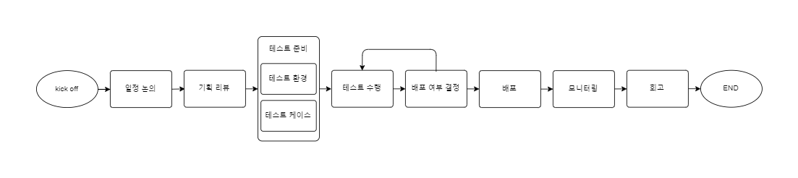

신규 프로젝트를 맡았을 때 어떤 식으로 QA를 진행하고 있는지 정리해보려고 합니다.

사실 제가 겪어본 회사에서는 QA 프로세스들이 나름 비슷했었던 것 같습니다.
다르게 말하자면 일반적인 프로세스가 있다는 것 같습니다.

## 일정 논의
(사업성 판단 및 구현 가능 여부 판단은 끝났다는 가정)

프로젝트의 전체 일정을 잡고, 그중에서 QA 일정을 정합니다. 대체적으로 이때에는 세부적인 기획도 없어서 정확한 일정을 예상하기에는 쉽지 않습니다. 개인적으로는 기획 리뷰를 들으면 불가능?하지 않는 일정이 보입니다.

경험적으로는 데드라인은 사업에서 정하고 개발 일정이 딜레이되면 QA 일정만 줄어드는 안타까운 모습이 많았습니다.
## 기획 리뷰
기획이 정해지면 관련 부서가 모여 기획 리뷰를 진행합니다.

각 관련 부서에서 기획에서 궁금한 점, 유의해야할 점, 수정해야 할 점 등을 논의합니다. 아래는 예시들 입니다!
- (QA) 매수 정정을 두 번하려고 하면 주문번호 유지가 되나요?
- (준법감시) 매수/매도 색상은 달라야합니다.

사실 리뷰 문서를 미리 보고 회의에 들어갈 수 있다면 참 좋겠지만, 미리 전달주시는 분들이 많지 않고 주시더라도 업무가 바빠 상세히 읽는 것이 힘들긴 했습니다.
## 테스트 준비(+개발 리뷰)
기획 문서 및 논의된 결과를 통해서 테스트 준비를 시작합니다. 그리고 회사에 따라 개발 리뷰를 해주는 곳도 있었지만 드물었습니다 :)
- 테스트 환경: 테스트를 진행하기 위해서 필요한 것들을 준비합니다. 예를 들어, 결제 테스트를 위한 계좌를 미리 생성해 놓는다던지, 레버리지 ETF 매수를 위한 교육이수를 해놓는다던지 만들 제품에 따라 준비가 필요할 수 있습니다.
- 테스트 케이스: 테스트시 진행할 테스트 케이스를 작성합니다. 신규 제품이 독립적이라면 신규 기능만 확인하면 되지만, 기존 제품에 영향을 준다면 영향 범위의 테스트 케이스와 기존 제품의 리그레션 테스트 케이스도 같이 준비합니다. 테스트 케이스는 UI적인 것 뿐만이 아니라 API, Stress Test, Aging Test, Monkey Test 등 다양하게 구성됩니다.

이 단계에서 기획이 변하지 않는다면 제일 마음이 편하지만 실제로 개발을 진행할 때 문제가 생기거나 법률적인 문제, 아니면 다른 문제로 인해 바뀌는 경우가 많았습니다.
## 테스트 수행
준비한 테스트 환경에서 테스트 케이스를 가지고 테스트를 진행합니다.

이슈가 발생을 하면 이슈의 현상, 재현 스텝, 환경 등 상세하게 적어서 커뮤니케이션에 자원을 쓰지 않게 합니다.

테스트케이스 수행이 끝나면 테스트가 끝나는 것인가? 개인적으로는 중요 기능마다 탐색적 테스트를 진행합니다. ex. 로그인, 결제 등 
## 배포 여부 결정
운영 환경에 배포해도 되는지 결정을 합니다.

경험상 신규 프로젝트에서는 왠만하면 사업과 마케팅의 힘이 더 강하게 작용하여 어떻게든 서비스를 제공하지 못할 이슈가 아니면 배포를 하게 됩니다.
## 배포
환경에 따라 이제 운영 환경에 배포하기 위해서 배포 프로세스를 진행합니다.

소스코드 병합 부터, 환경별 배포를 진행합니다. 소스코드 변경사항이 브랜치에 잘 적용이 되었는지, 운영 환경과 비슷한 Stage 서버에 배포후 리그레션 테스트를 진행합니다.

Stage 서버에서 리그레션 후 이슈가 없다면 운영 서버까지 배포를 진행합니다.
## 모니터링
운영 환경까지 배포를 완료했다면, 이제 모니터링을 진행합니다.

모니터링 환경이 갖추어져 있다면 좋겠지만, 안되어 있는 곳에서는 CS, 리뷰, 게시판 등을 활용하고 직접 운영 환경에서도 리그레션 테스트를 진행하는 것이 좋습니다.

중대한 이슈가 발생한다면 수정을 하고 핫픽스로 배포를 진행합니다.
## 회고
신규 프로젝트를 진행하면서 잘했던 점, 못했던 점, 개선해야 할 점들을 가지고 프로젝트 참여 인원과 논의합니다.

사실 회고를 안하는 기업도 많지만 개인적으로는 했을 때 얻는 것이 훨씬 많다고 생각합니다. 하지만, 회고가 공격이 아닌 서로 발전하기 위한 활동임으로 워딩이나 분위기가 참 중요한 것 같습니다.
