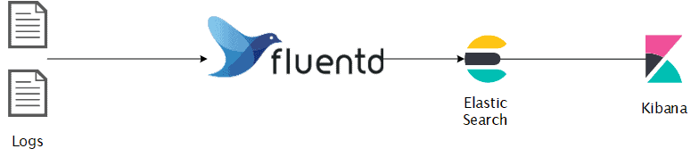

제가 현재 근무하고 있는 기업에서도 그리고 지나온 기업에서도 로그에 대한 모니터링을 할 수 있는 환경 구축이 미흡한 회사가 많았습니다. (거의 스타트업이 많았습니다!) 아무래도 devops 분들이 없는 회사도 있었고, 개발? 이라고 해야할지는 모르겠지만 우선순위가 높지 않았거든요. 사실 개별 서비스에 접근해서 로그를 보면 되긴 하니까요.

### QA 들은 로그 모니터링을 언제 사용할까요?

- 평상시에 DEV, STG, PROD 환경의 에러 로그가 올라오는지 확인
- 배포 후 에러 로그 모니터링
- 이슈 발생시 서버 에러 확인

등 개인적으로 여러 방면으로 사용하고 있습니다 :)

### EFK는 뭔가요?

EFK는 ElasticSearch-Fluentd-Kibana의 약자입니다. MSA 환경 같이 한 제품을 제공할 때 많은 서비스들이 운영되고 있는데, 이 많은 서비스들의 로그를 한 곳에서 쉽게 관리하고 모니터링하기 위한 솔루션입니다.

- Fluentd: 데이터 수집기로 다양한 소스(http, log file 등)로 부터 수집이 가능하며, plugin을 통해 다양한 목적지(elasticsearch, S3 등)으로 보낼 수 있습니다. 그리고 ELK(Logstash를 사용)보다 속도, 성능면에서 평가가 좋습니다.
- ElasticSearch: 검색 엔진으로 rest api를 제공하는 특징이 있으며, json를 사용하여 사용하기 용이합니다.
- Kibana: 정형화되지 않는 데이터를 대시보드 형태로 보여주는 것에 강점이 있습니다.

### 어떤 식으로 구성을 할 것인가요?

지금 현재 근무하고 있는 기업은 클라우드 환경이 아니지만, 온프로미스 환경에서도 작업 환경을 거의 비슷하게 구성해주는 도커로 구성하는 것이 좋겠다는 생각이 들었습니다. 그래서 EFK stack을 동시에 실행할 수 있는 docker-compose를 작성하여 docker 환경에서 구성해보도록 하겠습니다.

### 나머지는 다음 포스팅에서!

### 소스코드

사실 글로써 작성을 하고있긴 하지만, 테스트 환경은 이미 구축해놨습니다. 아래의 제 저장소에서 다운받아서 실행해보셔도 좋습니다!

https://github.com/chachamelon/EFK-stack