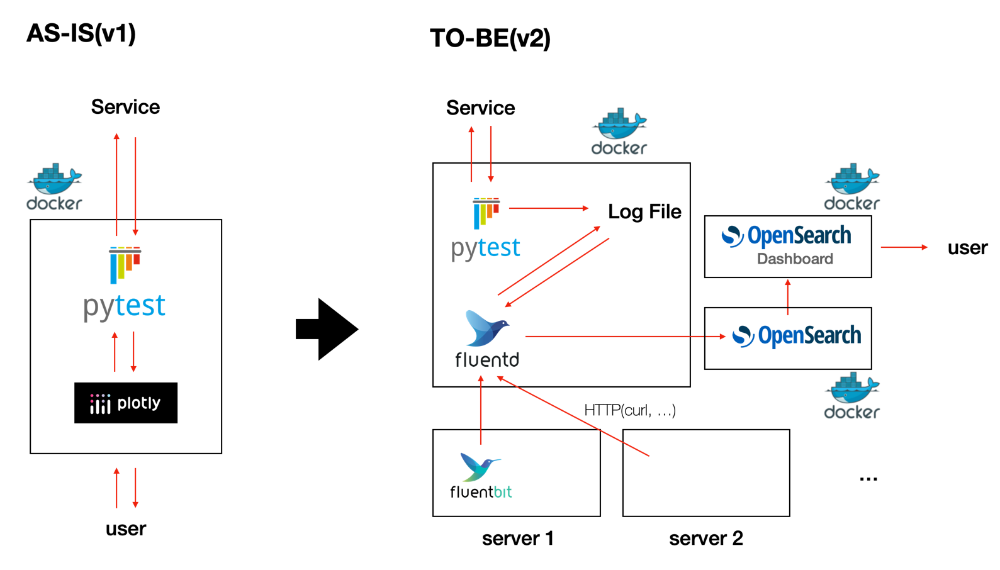

### WHY?
사실 EFK 스택을 활용하여 로그 파이프라인을 구축하려고 했습니다. 그런데, 모니터링의 꽃인 알림 기능을 사용하려면 xpack을 사용해야 하는데 이게 유료입니다...!
물론, 회사에서 돈을 내줄 수도 있겠지만 기왕이면..! 무료로 구축하고 다른 쪽에서 돈을 쓰는 것이 좋지 않을까....? 하다가 찾은게 Opensearch였습니다.

### Opensearch?
아마존에서 elasticsearch를 포크해서 상용화를 하면서 생긴 분쟁(https://www.ddaily.co.kr/page/view/2021013120111791417)이 있었습니다.
그때 아마존에서 오픈소스로 만든 프로젝트가 Opensearch입니다. Elasticsearch에서는 알림 기능이 유료지만, Opensearch에서는 무료입니다!
그래서 Opensearch를 사용해보기로 했습니다.

### Architecture
지금 일하고 있는 회사에서 임시로? v1 구조로 되어있는데, v2 구조로 가는게 이번 프로젝트의 목표입니다.


### How to do?
이미 Opensearch docs에 예제가 잘되어 있습니다!
https://opensearch.org/docs/latest/install-and-configure/install-opensearch/docker/#sample-docker-composeyml
위의 compose 파일 작성후 해당 경로에서 다음과 같은 명령어를 입력해줍니다.

```bash
cd /path/to/project
docker-compose up
```

### Fluentd 연결
fluentd image를 기반으로 필요한 플러그인을 설치합니다. 이 이미지를 기반으로 서비스를 올려도 되고, 기존 서비스에 Fluentd를 설치하셔도 됩니다.
저는 테스트 환경 구축을 위해서 이미지를 올렸습니다.

## Fluentd dockerfile
fluent-plugin-elasticsearch가 fluent-plugin-opensearch로 변한 정도입니다!

```bash
FROM fluent/fluentd:v1.16.2-debian-1.1

# Use root account to use apt

USER root

# below RUN includes plugin as examples elasticsearch is not required

# you may customize including plugins as you wish

COPY ./fluent.conf /fluentd/etc/fluent.conf

RUN buildDeps="sudo make gcc g++ libc-dev" \

 && apt-get update \

 && apt-get install -y --no-install-recommends $buildDeps \

 && sudo apt-get install -y libmariadb-dev \

 && sudo gem install fluent-plugin-opensearch \

 && sudo gem install fluent-plugin-out-http -v 0.1.4 \

 && sudo gem install fluent-plugin-mysql-bulk \

 && sudo gem sources --clear-all \

 && SUDO_FORCE_REMOVE=yes \

    apt-get purge -y --auto-remove \

                  -o APT::AutoRemove::RecommendsImportant=false \

                  $buildDeps \

 && rm -rf /var/lib/apt/lists/* \

 && rm -rf /tmp/* /var/tmp/* /usr/lib/ruby/gems/*/cache/*.gem
```

### fluent.conf

tail로 특정 파일을 읽는데, 정해진 정규 표현식으로 파싱하여 Json 형태로 보내줍니다.
- alternatives.log 는 기존 이미지에 있는 파일로 아래와 같은 예제처럼 로그가 남습니다.
```
update-alternatives 2023-09-07 02:13:41: link group cc updated to point to /usr/bin/gcc
```

```bash
# echo '{"hello":"world"}' | tee -a /var/log/2023-12-10.log
<source>
    @type tail
    @log_level warn
    <parse>
      @type regexp
      expression /^(?<NAME>\w+-\w+) (?<DATE>\d+-\d+-\d+) (?<TIME>\d+:\d+:\d+): (?<MESSAGE>.*)$/
    </parse>
    path /var/log/alternatives.log
    pos_file /var/log/tmp/log_file.pos_file
    tag log.test
</source>
# curl -X POST -d {\"foo\":\"bar\"} http://localhost:9880/api.log
<source>
    @type http
    port 9880
    bind 0.0.0.0
    tag http_listener_test
    <parse>
        @type json
    </parse>
</source>
<match *.**>
    @type copy
    <store>
        @type opensearch
        host opensearch-node1
        port 9200
        user admin
        password admin
        scheme https
        ssl_verify false
        logstash_format true
        logstash_prefix fluentd
        logstash_dateformat %Y%m%d
        include_tag_key true
        type_name access_log
        tag_key @log_name
        flush_interval 1s
    </store>
    <store>
        @type stdout
    </store>
</match>
```
